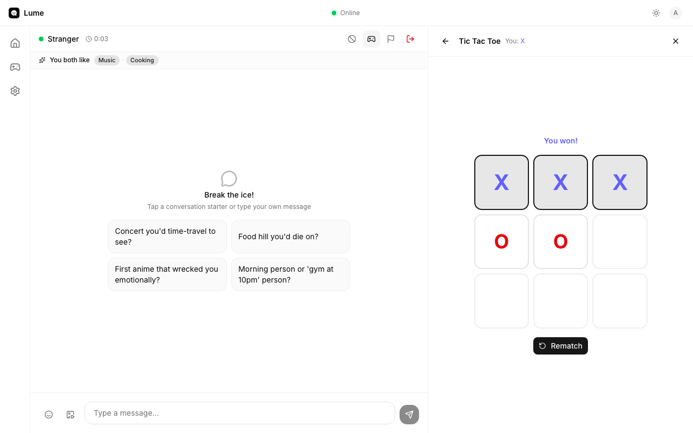
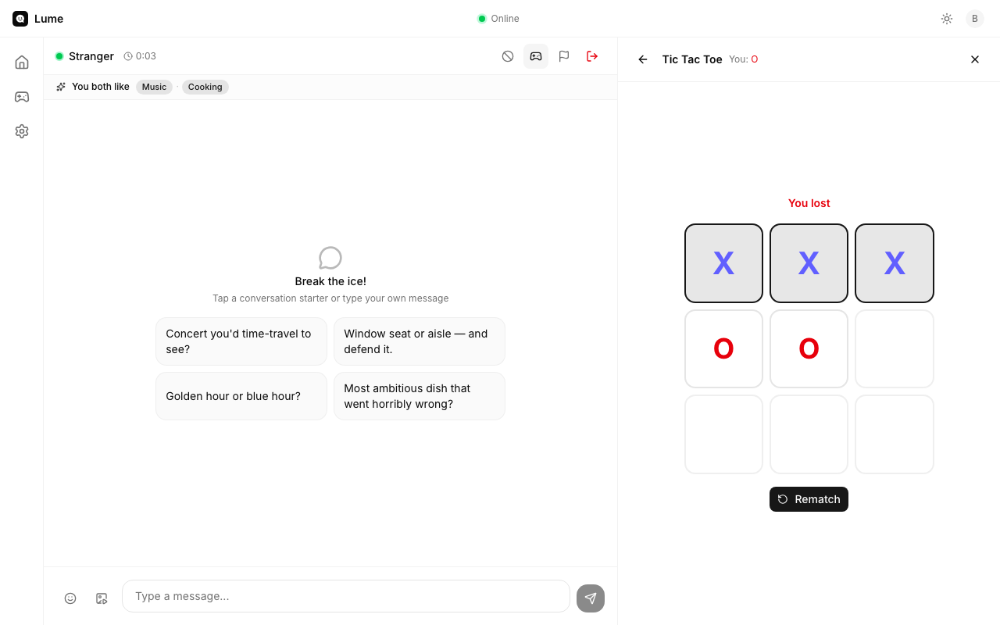
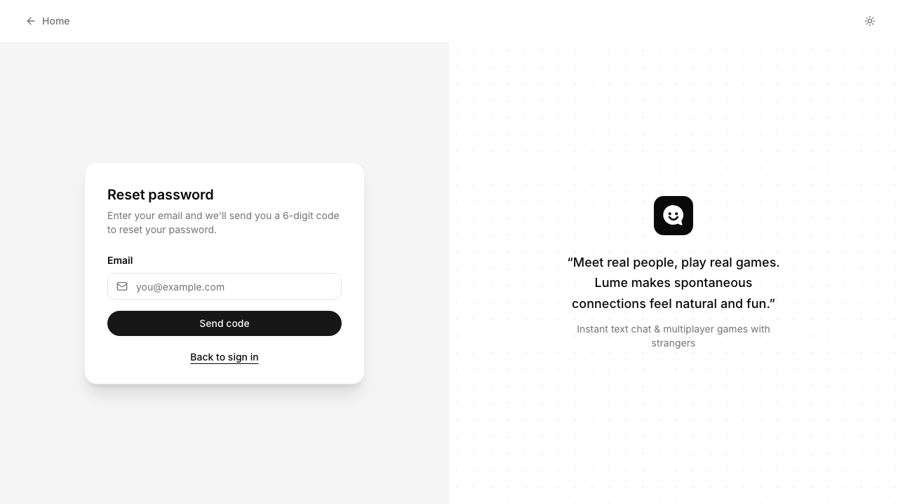
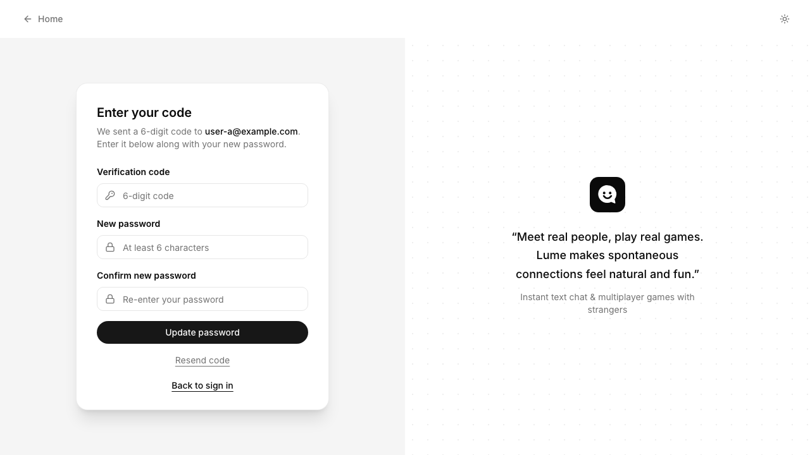

# Lume

> Meet strangers through ephemeral chat and quick multiplayer games. A safer, game-forward take on Omegle-style random chat.

[](./LICENSE)


**[Live demo →](https://lume-roan.vercel.app)**



## What's inside

- **Auth + onboarding** — email/password, 18+ age gate, display name, region, interest tags. Forgot-password via 6-digit email OTP.
- **Matchmaking** — server-authoritative pairing via a Supabase Edge Function on a 2-second `pg_cron`. Scores interest overlap, region, age proximity, and respects blocks plus a recent-pair cooldown.
- **Realtime chat** — Supabase Broadcast, never persisted. Typing indicator, presence, end/disconnect states, elapsed timer.
- **Inline games** — 7 two-player games (Tic Tac Toe, Trivia, Would You Rather, RPS, Two Truths & a Lie, Emoji Charades, Draw & Guess) synced over Broadcast. Word Chain and Chess are placeholder.
- **Safety** — Report dialog, silent block, recent-pair cooldown, Edge Function pre-filter. Legal routes at `/terms`, `/privacy`, `/community-guidelines`.
- **Theme** — Light/dark toggle with no FOUC.
- **Tested with [Passmark](https://github.com/bug0inc/passmark)** — natural-language regression suite over Playwright.

| Shared interests + Tic Tac Toe loss | Forgot password | Reset password |
| :--: | :--: | :--: |
|  |  |  |

## Stack

TanStack Start (React 19 + Vite 7 + Nitro SSR) · Supabase (Auth, Realtime, Edge Functions, pg_cron) · Tailwind v4 · shadcn/ui · TypeScript · Biome.

## Run it locally

**Prereqs:** Node 20+, Docker (for local Supabase), [Supabase CLI](https://supabase.com/docs/guides/cli).

```bash
# 1. Clone and install
git clone https://github.com/hempun10/lume.git
cd lume
npm install

# 2. Copy env templates and fill in Supabase keys (see `npx supabase status`)
cp .env.example .env
cp .env.local.example .env.local

# 3. Start Supabase locally (Postgres + Auth + Realtime + Mailpit on :54324)
npm run db:start

# 4. Apply migrations, regenerate types, seed two test users
npm run db:reset

# 5. Run the dev server
npm run dev
```

App runs at <http://localhost:3000>.

### Seeded users

| Display name | Email | Password | Interests |
| --- | --- | --- | --- |
| **Alice** | `user-a@example.com` | `password123` | Music, Travel, Photography, Cooking |
| **Bob** | `user-b@example.com` | `password123` | Music, Cooking, Anime, Fitness |

The two overlapping interests (Music, Cooking) are what the shared-interests banner picks up when they match.

### Try the full flow in two browsers

1. Log in as **Alice** in one window and **Bob** in an incognito window via `/login`.
2. Click **Start matching** on both dashboards. They pair within a few seconds.
3. In Alice's chat, look for the **"You both like Music · Cooking"** banner.
4. Open the **Games** drawer, pick **Tic Tac Toe**, play a round. Both windows sync.
5. Try **Report → Also block** to exclude the pair from future matches.
6. Sign Alice out, hit **Forgot password**, then open Mailpit at <http://127.0.0.1:54324> to grab the 6-digit code.

## Test it

The regression suite uses [Passmark](https://github.com/bug0inc/passmark), which drives Playwright with natural-language steps and judges results from screenshots. Set `OPENROUTER_API_KEY` in `.env.local` first.

### Against your local dev server

```bash
npx playwright install chromium   # one-time

npm run db:reset                  # known-good seed
npm run dev                       # in another terminal

npm run test:e2e:smoke            # landing-only smoke test
npm run test:e2e                  # full chromium suite (~31 tests)
npm run test:e2e:headed           # watch the AI clicks happen
npm run test:e2e:report           # open the last HTML report
```

### Against the live demo (or any preview URL)

```bash
PLAYWRIGHT_BASE_URL=https://lume-roan.vercel.app npm run test:e2e
```

Auth-recovery and realtime specs need the local Supabase stack because they read from Mailpit and use seeded users:

```bash
npm run db:start
RUN_REALTIME_PASSMARK=1 npx playwright test e2e/passmark/realtime-matchmaking.spec.ts
npx playwright test e2e/passmark/auth-recovery.spec.ts
```

See [`docs/PASSMARK_TEST_PLAN.md`](docs/PASSMARK_TEST_PLAN.md) for the coverage matrix and [`docs/HASHNODE_DRAFT.md`](docs/HASHNODE_DRAFT.md) for the story of three real bugs the suite caught.

## Scripts

```bash
# Dev
npm run dev          # dev server on :3000
npm run build        # production build
npm run preview      # serve the production build

# Quality
npm run typecheck    # tsc --noEmit
npm run check        # Biome lint + format check
npm run lint         # Biome lint only
npm run format       # Biome format only

# Database
npm run db:start     # start local Supabase
npm run db:stop      # stop local Supabase
npm run db:reset     # reset DB, regen types, seed users
npm run db:seed      # seed test users
npm run db:types     # regenerate TypeScript DB types

# Edge functions
npm run functions:serve    # run locally
npm run functions:deploy   # deploy
npm run functions:invoke   # invoke for debugging
```

## Routes

| Route | Description |
| --- | --- |
| `/` | Landing |
| `/terms`, `/privacy`, `/community-guidelines` | Legal |
| `/login`, `/signup`, `/logout` | Auth |
| `/forgot-password`, `/reset-password` | OTP recovery |
| `/onboarding` | Profile setup (protected) |
| `/dashboard` | Lobby + matchmaking (protected) |
| `/chat` | Realtime chat with inline games (protected) |
| `/games` | Games catalogue (protected) |
| `/settings` | Profile + interests editor (protected) |

Protected routes redirect to `/login` when signed out and to `/onboarding` when the profile is incomplete.

## Project layout

```
e2e/passmark/                 Natural-language regression suite
src/routes/                   File-based TanStack Router routes
src/features/auth/            Auth + onboarding context and forms
src/features/lobby/           Match queue and realtime subscription
src/features/chat/            Realtime chat, safety dialog, game host
src/features/games/           Game engines, boards, room sync
src/features/settings/        Profile + preferences editor
src/lib/supabase/             Supabase browser/server clients
supabase/functions/match-users/   Server-authoritative matchmaker
supabase/migrations/          Schema, RLS, functions, cron setup
docs/                         PRD, test plan, hackathon writeup
```

## Deployment

Configured for Vercel. Set `VERCEL_TOKEN`, `VERCEL_ORG_ID`, `VERCEL_PROJECT_ID` plus the `VITE_SUPABASE_*` and `SUPABASE_SECRET_KEY` env vars. Pushes to `main` deploy to production after CI and migration checks.

## License

[MIT](./LICENSE).
