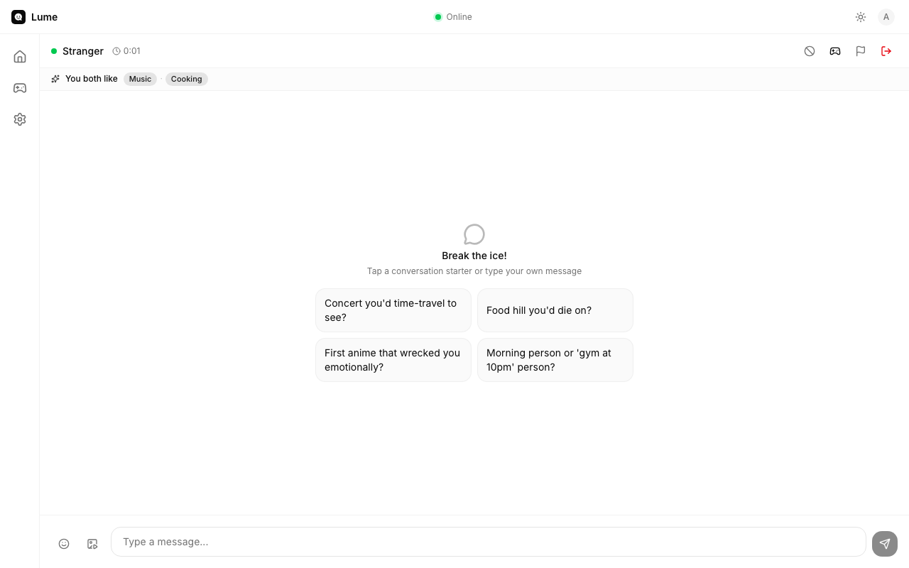

<!--
Hashnode submission metadata
- Title: Breaking Lume: how Passmark caught a silent RLS bug, an OTP flow regression, and a hydration race in my realtime stranger-chat app
- Subtitle: A Passmark + Playwright regression suite for a TanStack Start + Supabase Realtime app — with three real bugs caught.
- Slug: breaking-lume-passmark-regression-suite
- Cover image: ./images/ttt-win.png
- Tags: BreakingAppsHackathon, passmark, playwright, supabase, tanstack, testing, react, typescript, ai, hackathon
- Canonical URL: https://github.com/hempun10/lume/blob/main/docs/HASHNODE_DRAFT.md
- Hashtag: #BreakingAppsHackathon (must appear in body)
- Mentions: @bug0inc on social posts
-->

# Breaking Lume: how Passmark caught a silent RLS bug, an OTP flow regression, and a hydration race in my realtime stranger-chat app

> Submission for the Bug0 **Breaking Apps Hackathon** — `#BreakingAppsHackathon` — deadline May 10, 2026 11:59 PM PT.


## TL;DR

I have an open-source realtime stranger-chat app called **Lume** (TanStack Start + Supabase Realtime). I replaced its previous E2E suite with a **Passmark + Playwright** regression suite that drives the app via natural-language steps backed by AI, falls back to deterministic Playwright for setup, and uses a custom email-OTP provider that reads from local Mailpit.

In the process Passmark caught **three real bugs** that had been hiding in plain sight:

1. A silent RLS policy gap that made every chat's *PromptSuggestions* and *PromptCards* fall back to generic prompts.
2. A magic-link recovery flow that didn't actually work end-to-end against Supabase's local stack.
3. A hydration race that made login and signup forms intermittently submit as a GET request with credentials in the URL.

Repo: https://github.com/hempun10/lume — branch `main`. Live demo: https://lume-roan.vercel.app.

---

## 1. What is Lume?

Lume is a safer, game-forward alternative to Omegle-style random chat. The product surface is much wider than a typical hackathon submission:

- Email/password auth + 18+ consent + DOB validation
- Onboarding (display name, gender, region, 1–8 interests)
- Protected dashboard with TanStack Router route guards
- Matchmaking via Supabase Realtime + a Postgres `match_queue` + a `pg_cron`-driven Edge Function that scores candidates by interest overlap, region, and age proximity
- Ephemeral 1:1 chat (messages intentionally not persisted)
- Inline multiplayer games over Broadcast, with Tic Tac Toe as the realtime sync canary and Word Chain / Chess gated as "coming soon"
- Report + block flows that exclude pairs from future matching
- Forgot-password via 6-digit email OTP

That's a lot of moving parts, which is exactly the kind of thing where AI-driven regression testing is more valuable than a wall of brittle selectors.

## 2. Why Passmark was a good fit for this app

Three properties of Lume make it a poor fit for traditional E2E test frameworks and a great fit for Passmark:

- **Lifecycle transitions matter more than DOM details.** "Lobby → searching → cancel → idle", "signup → onboarding → dashboard", "chat → game invite → game panel" are the flows where regressions actually hurt. Selectors describe markup; Passmark steps describe intent.
- **Realtime + ephemeral state is hard to assert deterministically.** Messages aren't persisted. The matchmaker is non-deterministic when there are >2 users in the queue. A snapshot-based AI assertion handles "Bob's chat timeline contains the incoming message 'hello from passmark' from the stranger" much more gracefully than fishing for a `[data-message-id]` selector.
- **Accessibility is a side effect.** Telling Passmark to "click 'Start matching'" forced me to make sure that label was actually present and unambiguous — which is also exactly what a screen reader user needs.

## 3. The suite at a glance

| Spec | What it locks in | Flow type |
|---|---|---|
| `landing.spec.ts` | Marketing pages, Terms/Privacy/Community Guidelines render | Static |
| `landing-interactions.spec.ts` (10 tests) | Anchor scroll, theme toggle, FAQ accordion, session-aware CTA, theme-aware imagery | Interactive |
| `auth-flows.spec.ts` | Login, logout, duplicate-signup, authed redirect from /login & /signup | Auth |
| `auth-guards.spec.ts` | Signed-out access to dashboard/settings/games/chat is blocked | Auth |
| `auth-onboarding.spec.ts` | Signup → onboarding; required fields; DOB picker year-dropdown excludes current year | Auth |
| **`auth-recovery.spec.ts`** | **Forgot-password → 6-digit OTP from Mailpit → reset → login with new pw** | **Auth (Passmark + email)** |
| `dashboard-lobby.spec.ts` | 5-cap interest chips, Text↔Games toggle, Start/Cancel match, navigation | Lobby |
| `dashboard-prompts.spec.ts` | Break-the-ice shuffle + clipboard copy | Lobby |
| `settings.spec.ts` | Profile + preferences save, persistence, 8-cap, empty-blocks-save, lobby reflection | Settings |
| `games-catalog.spec.ts` | 7 available games + Word Chain/Chess "coming soon" + Play routing | Games |
| `chat-safety.spec.ts` *(opt-in)* | Report dialog reason validation, Also block | Safety |
| **`realtime-matchmaking.spec.ts`** *(opt-in)* | **Two browsers match into the same room AND see a "You both like Music · Cooking" banner** | **Realtime** |

The two opt-in specs are gated behind `RUN_REALTIME_PASSMARK=1` because they need the local Supabase stack (realtime + pg_cron + Edge Functions) to be healthy.

## 4. Setup that mattered

A few choices that paid off:

- **Pinned the model.** I locked Passmark to `google/gemini-2.5-flash` via `playwright.config.ts`. Without pinning I hit OpenRouter 400s on flow-routed model selection.
- **Deterministic auth, AI for behavior.** Logging in is not the test target in 95% of specs, so `loginAsSeededUser` uses plain Playwright. Passmark only kicks in for the actual flow under test. This saves credits and removes flake.
- **One concern per Passmark test.** Snapshot-based AI judging works much better with focused assertions than with kitchen-sink scenarios. I split the original `dashboard-settings.spec.ts` into three files (`dashboard-lobby`, `dashboard-prompts`, `settings`).
- **Mobile-specific gating via `testInfo.skip`.** A few tests don't apply on the mobile project; a single line keeps them out of the matrix.
- **Bumped Supabase's local sign-in/up rate limit in committed config.** Default is 30 / 5 min; the suite legitimately exceeds that with parallel runs. Bumped to 300 in `supabase/config.toml`.

## 5. Three bugs Passmark caught (the actual story of this hackathon)

### Bug #1 — A silent RLS policy gap broke chat prompts for everyone

This one is my favourite, because the app *looked* fine.

When two users matched, the chat opened with a "Break the ice!" panel showing prompt cards. I'd written `<PromptSuggestions />` to take `strangerProfile.interests` and generate interest-keyed conversation starters ("favourite album you'd recommend", etc.). The intent was: a stranger with `Music` in their interests should see music-themed prompts.

In practice every chat fell back to the generic prompt set ("Pineapple on pizza — defend your stance"). I had never noticed because:

- The fallback prompts are reasonable.
- I tested locally as a single user.
- No selector test ever asserted the *content* of the cards.

When I added a `<SharedInterestsBanner />` component for the new realtime test ("You both like Music · Cooking"), the banner refused to render. Same root cause.

The bug:

```sql
-- supabase/migrations/...add_profile_fields.sql (original)
CREATE POLICY "Users can read own profile"
  ON public.profiles FOR SELECT
  USING (auth.uid() = id);
```

That was the **only** SELECT policy on `profiles`. So `useStrangerProfile`'s `select("display_name, interests").eq("id", strangerId)` returned an empty payload for every other user — silently. No error, just "no rows".

The fix:

```sql
-- supabase/migrations/20260502000000_allow_reading_room_counterpart_profile.sql
CREATE POLICY "Users can read room counterpart profile"
  ON public.profiles FOR SELECT
  TO authenticated
  USING (
    EXISTS (
      SELECT 1 FROM public.rooms r
      WHERE (r.user_a = auth.uid() AND r.user_b = profiles.id)
         OR (r.user_b = auth.uid() AND r.user_a = profiles.id)
    )
  );
```

Narrowly scoped: a user can read another profile *only* if they share an active row in `public.rooms`. Profiles aren't globally readable.



The banner above plus the four interest-themed prompt cards (Concert / Food hill / First anime / Morning person) are *all* downstream of the same Supabase query. Before the migration, every chat fell back to the generic prompt set.

The thing I want to highlight: **Passmark forced me to write a meaningful behavioural assertion**, and the assertion couldn't pass until the data flow was correct. A unit test on `useStrangerProfile` would have mocked Supabase and never seen this.

### Bug #2 — The magic-link recovery flow didn't actually work end-to-end

The original `/forgot-password` sent a magic link via `supabase.auth.resetPasswordForEmail(email, { redirectTo })`. The user clicked the link, was supposed to land on `/reset-password` with a recovery session, and could set a new password.

Local Supabase routes all auth emails through Mailpit, so I assumed Passmark could "click" the link the same way a user would. It can't, cleanly — the link is in an email body, in a separate tool, behind redirects.

So I rewrote the entire flow as **email OTP**:

- `/forgot-password` → enter email → "Send code" → redirects to `/reset-password?email=…`
- `/reset-password` → 6-digit code + new password + confirm → `verifyOtp({ type: "recovery" })` → `updateUser({ password })` → `/dashboard`

That left the question: how does Passmark actually pull the OTP out of Mailpit? Built a **custom Passmark `EmailProvider`**:

```ts
// e2e/passmark/mailpit-provider.ts
import type { EmailProvider } from "passmark";

export function mailpitProvider(): EmailProvider {
  const baseUrl = process.env.MAILPIT_URL ?? "http://127.0.0.1:54324";
  return {
    domain: "@example.com",
    async extractContent({ email, prompt }) {
      // Poll Mailpit's /api/v1/messages for the latest message to `email`.
      // If `prompt` mentions "code" or "otp", regex out the 6-digit token.
      // Otherwise return the body verbatim.
    },
  };
}
```

Wired into Passmark in `playwright.config.ts`:

```ts
configure({ email: mailpitProvider() });
```

The test then uses the placeholder syntax:

```ts
await runSteps({
  page, test,
  userFlow: "Reset password using the OTP from the recovery email",
  steps: [
    {
      description: "Fill the 'Verification code' field with the 6-digit code from the recovery email",
      data: { value: `{{email.otp:get the 6 digit verification code:${email}}}` },
    },
    { description: "Fill the 'New password' field", data: { value: newPassword } },
    { description: "Fill the 'Confirm new password' field", data: { value: newPassword } },
    { description: "Click the 'Update password' button" },
  ],
});
```

The test then verifies in plain Playwright that the **old password no longer signs in** and the **new password reaches `/dashboard` or `/onboarding`**. That last part matters: Passmark proves the UI flow worked; Playwright proves the password actually changed in the database.


### Bug #3 — Login form occasionally submitted as GET with credentials in the URL

While running the realtime test (two browser contexts in parallel), one context kept landing on `/login?email=...&password=...` instead of `/dashboard`. The form was submitting *before* React hydration replaced it with the controlled SPA version, so the browser used the default GET action.

Symptom:
```
Received string: "http://127.0.0.1:3000/login?email=...&password=new-h6fj9zie"
```

This is the kind of bug that's invisible in single-context runs and impossible to reproduce manually. It surfaced because two contexts hammering the preview server slowed hydration past my 2000 ms blanket sleep.

Fix in `e2e/passmark/helpers.ts`:

```ts
await page.goto(`${BASE_URL}/login`, { waitUntil: "networkidle" });
const emailField = page.getByLabel("Email");
await emailField.waitFor({ state: "visible", timeout: 15_000 });
await page.waitForTimeout(1500); // give the controlled inputs a beat to mount
await emailField.fill(user.email);
```

Lesson: blanket `waitForTimeout` is not enough for SSR'd SPA forms. Wait for the *element* state, not for the clock.

## 6. Things I changed in the product because of the test suite

These weren't bugs per se, but Passmark exposed gaps:

- **A11y**: `<InterestTagSelector />` was missing `aria-pressed` on its chips. Only the lobby's chip selector had it. Adding it lets Passmark (and screen readers) know which chips are currently selected.
- **A11y**: chat header, game card, and dashboard avatar all got explicit `aria-label`s after Passmark complained that "Stranger" by itself was ambiguous.
- **Onboarding DOB picker**: I rebuilt this using shadcn's `captionLayout="dropdown"` so the year dropdown only includes years where the user would already be 18+. Previously the test could pick a current-year date and bypass the rule.
- **Lobby reflection**: Settings → Save preferences must update the lobby's "Your vibe" card. Passmark caught two cases where a stale React Query cache made the save look successful but the card didn't update.

## 7. Surprises

- **Snapshot-based AI assertions race against fast redirects.** My OTP reset originally auto-redirected after 1500 ms; Passmark's first AI check takes ~22 s, so by the time it looked, the success alert was already gone. Two fixes: (a) bumped the redirect to 3500 ms, (b) dropped the `waitUntil` and relied on a Playwright assertion immediately after `runSteps`. The lesson: Passmark and `setTimeout` don't compose naturally — let one of them own the "wait".
- **Two-browser tests are surprisingly easy.** `runSteps` is per-page, so two contexts = two parallel Passmark drivers via `Promise.all`. The hard part is making sure *both* browsers reach a stable state before assertions run, not the AI part.
- **Pinning the model is non-optional.** Without `model: "google/gemini-2.5-flash"` in `configure()`, OpenRouter occasionally routed to a model that produced 400s. Pinning made the suite reproducible.

## 8. How to run this yourself

You can take Lume for a spin in three ways: a **live demo** with your own account, a **local run with two seeded users** (the fastest path), or **the full Passmark suite** to reproduce the regressions.

### Option A — Try the live demo (90 seconds)

1. Open https://lume-roan.vercel.app in two browser windows (regular + incognito works fine).
2. Sign up two accounts with different emails. Confirmation isn't required on the demo; you go straight into onboarding.
3. Complete onboarding for both — pick at least one overlapping interest (e.g. both pick `Music`).
4. Click **Start matching** in both lobbies. Within a few seconds you'll be paired into a chat.
5. Walk through the flows: send messages, open the **Games** drawer and start Tic Tac Toe, try **Report**, try **Block**.

### Option B — Run locally with the seeded users (recommended for review)

Prereqs: Node 20+, [Supabase CLI](https://supabase.com/docs/guides/cli), Docker (for the local Supabase stack).

```bash
# Clone and install
git clone https://github.com/hempun10/lume.git
cd lume
npm install

# Start the local Supabase stack (Postgres + Auth + Realtime + Mailpit at :54324)
npm run db:start

# Reset the schema, regenerate types, and seed Alice + Bob
npm run db:reset

# Start the dev server on http://localhost:3000
npm run dev
```

The seed creates two accounts you can log in as immediately — no signup needed:

| Display name | Email | Password | Interests |
|---|---|---|---|
| **Alice** | `user-a@example.com` | `password123` | Music, Travel, Photography, Cooking |
| **Bob** | `user-b@example.com` | `password123` | Music, Cooking, Anime, Fitness |

Note the two overlapping interests (`Music`, `Cooking`) — that's what the shared-interests banner from Bug #1 picks up.

**Manual flow to exercise everything:**

1. Open `http://localhost:3000` in two browsers (Chrome regular + Chrome incognito, or Chrome + Firefox).
2. Log in as **Alice** in window 1 and **Bob** in window 2 via `/login`.
3. In both windows click **Start matching** on the dashboard. They should match within a few seconds.
4. In Alice's chat, confirm the **"You both like Music · Cooking"** banner is rendered (this is the Bug #1 regression check).
5. Send a few messages back and forth.
6. Open the **Games** drawer in either window → pick **Tic Tac Toe** → play a round; both windows should sync moves over Supabase Broadcast.
7. From either side, hit **Report** → choose a reason → tick **Also block** → confirm. The pair is now excluded from future matching.
8. Sign out Alice, click **Forgot password** on `/login`, send the OTP, then open Mailpit at `http://127.0.0.1:54324` and copy the 6-digit code. Reset her password and log in with the new one (this is the Bug #2 regression check).

### Option C — Run the Passmark regression suite

Set `OPENROUTER_API_KEY` in `.env.local` (see `.env.example`), then use the package.json scripts:

```bash
# Smoke test (landing only — fastest sanity check on the AI driver)
npm run test:e2e:smoke

# Full chromium suite (~31 tests, ~6–7 min after a fresh db:reset)
npm run test:e2e

# Same suite, headed (watch the AI clicks happen)
npm run test:e2e:headed

# Show the last HTML report
npm run test:e2e:report

# Realtime two-browser test (opt-in)
RUN_REALTIME_PASSMARK=1 npx playwright test e2e/passmark/realtime-matchmaking.spec.ts
```

The recovery and matchmaking specs need the local Supabase stack running (`npm run db:start`). Everything else can target the Vercel demo with `PLAYWRIGHT_BASE_URL=https://lume-roan.vercel.app npm run test:e2e`.

## 9. Final results

```txt
# Default chromium suite (no realtime gating)
npm run test:e2e
→ ~31 tests, ~6–7 minutes after `npm run db:reset`

# Realtime opt-in
RUN_REALTIME_PASSMARK=1 npx playwright test e2e/passmark/realtime-matchmaking.spec.ts
→ 1 passed (1.5 min)

# Recovery
npx playwright test e2e/passmark/auth-recovery.spec.ts
→ 1 passed (44 s)
```

Three real bugs caught and fixed in the hackathon suite:
- A missing RLS policy that silently degraded every chat's prompt cards (Bug #1).
- A magic-link recovery flow that only worked in the manual-testing happy path (Bug #2).
- A hydration race that occasionally leaked credentials into the URL (Bug #3).

Plus a handful of accessibility and state-sync gaps Passmark uncovered along the way (section 6).

## 10. Closing thought

Selectors describe HTML. Passmark steps describe what the user is *trying to do*. For a realtime social app where the surface area is mostly state machines and ephemeral data, the second framing maps onto the actual product risk. The bugs I found weren't "this button is missing" — they were "this feature looks fine but is silently degraded", and that's exactly the class of bug that a screenshot-and-prose AI judge is shaped to find.

If you're building anything with auth + realtime + ephemeral state, give Passmark a shot. The investment is one weekend; the catch rate is real.

---

## Links

- Live demo: https://lume-roan.vercel.app
- Repo: https://github.com/hempun10/lume
- Branch: `main`
- Test plan: [`docs/PASSMARK_TEST_PLAN.md`](https://github.com/hempun10/lume/blob/main/docs/PASSMARK_TEST_PLAN.md)
- Bug0 hackathon: https://passmark.bug0.com

## Checklist before publishing

- [x] Default suite + realtime + recovery all green locally
- [ ] Playwright report screenshots captured (`npm run test:e2e:report`)
- [ ] Repo made public or judge-accessible
- [x] Article includes `#BreakingAppsHackathon`
- [ ] X / LinkedIn post drafted (see `docs/SOCIAL_POSTS.md`) and tagged `@bug0inc`
- [ ] Submitted before May 10, 2026 11:59 PM PT
